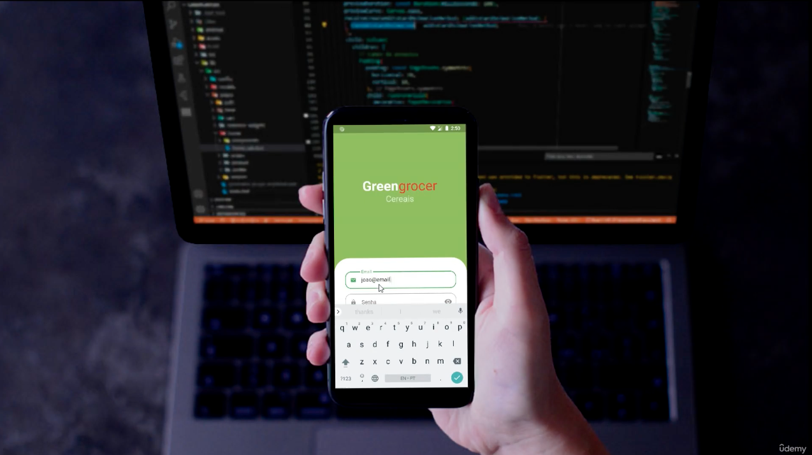

# Greengrocer

App de Quitanda Virtual com Flutter + GetX! Aqui você vai aprender inúmeros assuntos extremamente importantes, e que vão te possibilitar criar apps ainda mais incríveis e completos!

Está a fim de melhorar de vez o seu nível como desenvolvedor(a) Flutter? Então você está no lugar certo!

Aprenda a criar, do zero, um Aplicativo Completo de Quitanda Virtual, utilizando a tecnologia Flutter, e surfe a onda do framework que mais cresce no mercado.

Este é um curso 2 em 1: primeiro desenvolveremos toda a interface do app de quitanda virtual (Flutter UI), aprendendo a utilizar inúmeros widgets existentes e também criando os nossos próprios! No Flutter UI criaremos as telas abaixo:

### Tela de login:
 - Criação de widget customizado para todo o app;
 - Animações para apresentação de categorias disponíveis no app;
 - Cores customizadas;
 - Desenvolvimento de interface responsiva com widgets flex;
 - Criação de campo de texto customizado;
### Tela de cadastro:
 - Criação da tela de cadastro com formulário;
 - Criação de máscaras para campos;
 - Criação de rolagem da tela quando campo é focado;
### Tela base:
 - Criação da paginação de telas;
 - Criação da navegação por Bottom Navigation Bar;
### Tela home:
 - Apresentação de categorias com seleção;
 - Apresentação de produtos em grid;
 - Criação do campo de pesquisa;
 - Animação de envio de produto ao carrinho;
### Tela de detalhes do produto:
 - Apresentação de imagem, descrição, preço, nome;
 - Criação de widget customizado de quantidade;
### Tela do carrinho:
 - Incremento no widget customizado de quantidade;
 - Ajuste de quantidade de itens do carrinho e remoção;
 - Listagem de itens do carrinho;
### Tela de pedidos:
 - Listagem de pedidos;
 - Apresentação de status;
 - Listagem de produtos por pedido;
 - Apresentação de dialog de Pix;
### Tela de perfil:
 - Desenvolvimento de formulário de dados do usuário;
 - Dialog para mudança de senha;
 - Botão de sign out;
### Animações e features:
 - Aqui teremos inúmeras animações e features que vão incrementar ainda mais a nossa interface.

E não para por aqui! Vamos desenvolver também todas as funcionalidades do app de Quitanda Virtual! Por aqui vamos acompanhar temas como os principais pilares do GetX, como rotas, injeção de dependência, gerência de estado utilizando de seus Widgets especiais, assim como muitos outros métodos uteis do package GetX;

Vamos entender como funciona e aprender a realizar requisições REST em APIs reais;

Abaixo temos a lista de features que implementaremos nesse app totalmente do zero no módulo Flutter GetX:

### Autenticação:
 - Logar na aplicação;
 - Fazer o cadastro de um usuário;
 - Recuperação de senha;
 - Autenticação por token;
### Home:
 - Listagem de produtos;
 - Ordenação de produtos por categoria;
 - Filtragem pelo nome do produto;
 - Rolagem dinâmica de produtos;
### Carrinho:
 - Adição de produtos;
 - Atualização de quantidades;
 - Remoção de produtos;
 - Carrinho permanente (Quando sairmos do app os produtos não somem);
 - Realização de checkout;
### Pedido:
 - Listagem de pedidos;
 - Pagamento por QR code Pix;
 - Pagamento por copia e cola Pix;
### Perfil:
 - Visualização de dados do usuário;
 - Atualização de senha;
 - Logout.

Tá esperando o que pra desenvolver novas habilidades de Flutter e ficar à frente da concorrência?

Vídeo aulas rápidas, práticas e objetivas. Não perca tempo.

#### O que você aprenderá
 - Aprender e aperfeiçoar o desenvolvimento de interfaces em Flutter
 - Aprender a realizar comunicações com servidores reais (REST)
 - Aprender a utilizar de pilares do desenvolvimento que grandes projetos demandam
 - Aprender e desenvolver a lógica de programação
#### Há algum requisito ou pré-requisito para o curso?
 - Conhecimento básico de Dart/Flutter
#### Para quem é este curso:
 - Desenvolvedores iniciantes que querem aprender tudo o que é preciso para criar apps incríveis
